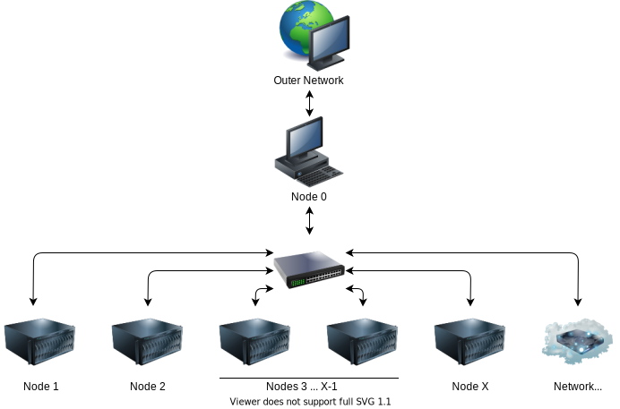

# How to set up cluster

The cluster (in scope of this repository) is a group of computers, which run under workload manager to:
- accept tasks from users
- build a queue of such tasks
- distribute execution of tasks across available computers
- store results in dedicated place

### Warnings
- This repository is not a set of instructions `How it must be done`, this repository is collection of my records on `How I implemented cluster with what was available`.
- This repository is still a **Work In Progress**

## Infrastructure and terminology

### Node 0 : Managing node
A.K.A. : `interactive node`, `head node`, `controlling node`

The computer to accept the tasks from users, create the queue, monitor availability of computation capacities and assigning tasks to available computers.

- functions as router so other computers in the network can access Internet (for update or software installation purposes)
- Must have 2 network interfaces (for router / bridge functionality)
- Recommended to have a discrete video-card (for convenience)

It also servers several secondary functions:
- DHCP server
- DNS server
- Firewall
- Time Server

Normally, the functionality of DHCP / DNS / NTP / Firewall / Router should be delegated to a separate node with a specialized software (alike [KerioControl](https://www.gfi.com/products-and-solutions/network-security-solutions/kerio-control)), but here we assume that cluster is located inside of network of some University / Organization which already have some sort of protection for network.

Node 0 can also serve as a computational node.

### Nodes 1...X : Computing nodes

These computers serve following purposes:
- Accept tasks from Node 0
- Process tasks (makes calculations)

Preferably: no desktop environment

### Network Attached Storage ([NAS](https://en.wikipedia.org/wiki/Network-attached_storage))

This unit serves as centralized storage to be accessible for all nodes in network to:
- store input data for calculations
- keep results of calculations

Can be a specially designed unit ([Synology](https://www.synology.com/en-uk), etc. ) or just a general purpose computer with NAS-purposed operation system (such as [FreeNAS](https://www.freenas.org/) / [XigmaNAS](https://www.xigmanas.com/), etc.)

This functionality can be implemented on `Managing node` (using `NFS` or `SAMBA`, etc.) but it is recommended to have a separate unit due to computational requirements for flowless functioning and access.

# Conventions in this "project"
- `Node 0`:
  - has 2 network interfaces for at least 1 GB/s bandwidth (more - better)
  - has an installed OS with Graphical Desktop Environment, but GDE is off by default start-up
  - has a discrete graphics card (for better performance in graphical mode) \
    **NB! :** not all computers allow to turn off the build in video-output (and integrated video card) and use discrete one.
  - doesn't perform any computation related to execution of assigned tasks
- `Nodes 1...X`
  - do all work on computation
  - has an installed OS with Graphical Desktop Environment, but GDE is off by default start-up
  - have individual local drives with installed OS (no network boot!)
- `Network Attached Storage` is a server with installed `FreeNAS`.
  - has small HDD / SSD to start-up from
  - a separate HDD(s) or SSD(s) to be used as shared storage
- All computers are set-up to:
  - auto start in case of power loss
  - allow the boot without attached periphery (like keyboards, etc.)

I prefer a [Fedora Server](https://getfedora.org/en/server/download/) with [GNOME](https://www.gnome.org/) as OS for this project, even though [Ubuntu](https://ubuntu.com/) may be a better choice in terms of variety of available specialized software.

# Used equipment

## Cluster itself
Computers:
- Dell System PowerEdge R415 (as `Node 0` and `NAS`) \
  as a server with ability to turn off the integrated video and use discrete video card
- HP ProLiant G5 (DL165) and G7 (as `Nodes 1 ... X`) \
  as server without possibility to turn of the integrated video card and turn on the discrete (as of G5)
- Generic 1 GBit Ethernet switch
- 1 keyboard + 1 mouse + 1 monitor

## Tools
- Needed:
  - bootable USB drive with [Clonezilla](https://clonezilla.org/downloads.php):\
    for cloning / copying / deploying distros on different computers
  - bootable USB drive with desired OS installer:\
    for installation
  - bootable USB with [FreeNAS](https://www.freenas.org/) installer
- Optionally:
  - [Red Key USB](https://www.kickstarter.com/projects/redkeyusb/redkey-usb-computer-data-wipe-tool-v3) or bootable USB with [DBAN](https://dban.org/):\
    to purge any residual info on servers after previous use
  - bootable USB with [GParted](https://gparted.org/download.php) \
    for editing disks / partitions sizes
  - external USB drive for storage and further re-deploying of distro images \
    **NB! :** Make sure that computers you have can provide enough power through the USB port for reliable work of external USB HDD.

- Alternatively:
  - use an external HDD/SDD with emulation of ISO (such as [ZALMAN ZM-VE350](https://www.zalman.com/US/Product/ProductDetail.do?pageIndex=1&pageSize=10&pageUnit=12&productSeq=914&searchCategory1=86&searchCategory2=89&searchCategory3=-99&searchKey=&searchWord=) / [IODD-2531](http://iodd.kr/wordpress/product/iodd-2531/), etc.)  

# Useful Links:
- [Server World](https://www.server-world.info/en/)
- [Nilfheim cluster](https://wiki.fysik.dtu.dk/niflheim/niflheim)
